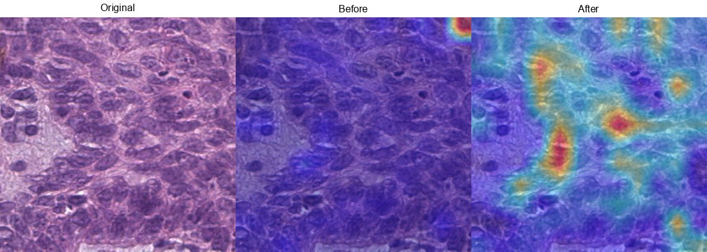

# SecondLook: a trust layer for a skin-cancer detector

[](LICENSE)


> Research and teaching demonstration only. Not a medical device. Not for diagnosis or clinical use.

SecondLook is for a **dermatopathologist, Mohs surgeon, or dermatologist** reviewing tissue tiles for basal cell carcinoma. They upload images. The app scores each tile with EfficientNet-B4, shows Grad-CAM attention, and maps the score to a three-tier call (positive / uncertain / negative). On a confident positive, Claude runs a constrained attention check - a spellcheck on whether that finding should be trusted, not a diagnosis of the patient. The detector class never changes. The doctor owns the final call.

The detector finds cancer. Claude decides whether to trust that finding.



- Left: a basal cell carcinoma tile.
- Center: baseline attention concentrates on the top-right padding corner, not the tissue.
- Right: after correction, attention sits on tissue.

## Try this first

1. Open the live app: https://aiedwardyi-secondlook.hf.space/
2. Open **Compare** on a positive tile.
3. Note `before`: corner heat, Claude **FLAGGED**. Note `after`: tissue heat, Claude **VERIFIED**. Same detector confidence class; different trust.

Video: https://youtu.be/uSuEFsHgjWU

## What Claude does

Claude reads the model, not the slide. It does not act as a pathologist and does not diagnose. On a confident **positive** call it runs an attention check - score plus where the heat sits (focus, corner, edge) - as a spellcheck on the detector finding. The card returns:

- **VERIFIED** - attention on tissue (attention check passed).
- **FLAGGED** - high score but heat on corner, edge, or frame; the case is added to the review queue and needs human review.
- **DEFER** - evidence is unclear, or the check fails closed (for example a missing API key).

Uncertain and negative calls skip the live audit. Uncertain already requires human review by design; negative has nothing to verify. Claude never changes the detector class - the card footer states "Detector class unchanged". On error, the system fails closed to DEFER.

**View evidence** expands focus / corner / edge heat with plain labels. **Ask Claude** is an optional follow-up about that tile's attention check only - it refuses diagnosis questions.

Product loop:

1. Detector scores the tile and builds Grad-CAM.
2. Code computes attention metrics (focus concentration, corner heat, edge heat).
3. Claude receives the score, those metrics, and the Grad-CAM image (vision).
4. Claude returns structured JSON only: `VERIFIED` | `FLAGGED` | `DEFER`, plain-language reason lines, and cited numbers.
5. Optional **Ask Claude** answers follow-ups about that check only; the trust status does not change.

Implementation: `src/trust/` (`auditor.py`, `heatmap_metrics.py`); FastAPI routes `/api/audit` and `/api/ask`.

## The detector underneath

EfficientNet-B4 produces a BCC score. Grad-CAM shows attention. The app maps the score into three tiers instead of a pure binary call:

- **POSITIVE** - at or above the upper threshold.
- **UNCERTAIN** - between the two thresholds; borderline scores stay for human review.
- **NEGATIVE** - at or below the lower threshold.

A pure binary cut forces a hard call on borderline tiles. The uncertain band keeps those cases with the doctor.

Two models share architecture, data, and hyperparameters; they differ only in augmentation:

- `before`: baseline. Test metrics are high, but Grad-CAM localizes to the top-right padding corner rather than to tissue.
- `after`: reflect padding plus random resized crop. Test metrics are comparable; Grad-CAM localizes to tissue.

Held-out test metrics (from `experiments/*/eval/eval_summary.json`; n_test = 28039; thresholds 0.7 / 0.3):

| Metric | before | after |
|---|---:|---:|
| Test AUC | 0.9982 | 0.9977 |
| Spec @ Sens 0.95 | 0.9961 | 0.9941 |
| Sens @ Spec 0.95 | 0.9947 | 0.9936 |
| PPV @ Sens 0.95 | 0.895 | 0.849 |

Aggregate scores stay high on both runs. The slight PPV dip on `after` is expected. Metrics alone do not separate the models; attention maps do. That is what the trust layer checks.

## Run locally

The gallery and Grad-CAM run on CPU or Apple Silicon. The app is a FastAPI server that serves the interface and calls the detector, Grad-CAM, and Claude. Setup guides start from zero:

- Windows: [docs/SETUP_WINDOWS.md](docs/SETUP_WINDOWS.md)
- Mac: [docs/SETUP_MAC.md](docs/SETUP_MAC.md)

Claude's trust check calls the Anthropic API, so you provide your own key. Copy `.env.example` to `.env` and set `ANTHROPIC_API_KEY`. The key stays server-side and is never exposed to the browser. Without a key, detector and heatmaps still run; the trust card fails closed to DEFER.

Then start the app:

| Windows | Mac |
|---|---|
| `.\run.bat` | `bash run.sh` |

Open http://127.0.0.1:8000. Use **Examples** for curated tiles, or **Compare** for before and after attention side by side.

Training the detector needs an NVIDIA GPU with roughly 10 GB of VRAM or more (developed on an RTX 3080 at batch size 16) plus the full dataset (see Data). The live app does not require the full tile archive; curated gallery images ship in `gallery/`.

**Reproduce the before/after attention without retraining.** Both checkpoints ship in the repo (`weights/bcc_before.pth` and `weights/bcc_after.pth`). Open Compare on a positive tile to see corner heat vs tissue heat side by side.

**Show saved test metrics without recomputing.** Committed run logs re-print on a fresh clone:

```
.\results.bat before
.\results.bat after
```

**Retrain either model (optional, GPU).** See the setup guides for `train.bat` / train commands and the full Heidelberg data layout.

## Using the app

- **Single Image Analysis**: drop in a tile for score, Grad-CAM ("where the model looked"), and Claude's attention check when the call is positive.
- **Examples**: curated gallery with a score bar under each tile. Open a tile to run the detector and trust check.
- **Compare**: same tile under before and after - top-right corner heat becomes FLAGGED; tissue heat becomes VERIFIED.
- **Claude Attention Check**: VERIFIED / FLAGGED / DEFER card with short reason lines, View evidence, and optional Ask Claude.
- **Review queue**: FLAGGED (and DEFER) cases land here; open a case, mark reviewed, or keep in queue. Session-only.
- **Thresholds**: two sliders set where POSITIVE and NEGATIVE begin. Lines on the Examples score bars move live; tiles re-label with no new model or Claude call.

A score near a cut can flip POSITIVE ↔ UNCERTAIN (or NEGATIVE) when you move the line. The user sets the band; the detector score itself does not change.

## Data

The full tile archive is not stored in the repository. The split manifest (`splits/heidelberg_bcc.csv`) is included. For training or full evaluation, download the tiles and extract them in place:

1. Open the dataset page: https://doi.org/10.11588/data/7QCR8S
2. Download the dataset files.
3. Unzip the archive directly into the repository folder. The Heidelberg archive carries its own `data/` folder, so the tiles come to rest at `data/data/tiles/...` under the repository root. This nested `data/data` is expected; do not move or rename anything.
4. From the repository root (with the project venv active), verify placement against the manifest:

```
python -m scripts.prepare_data --data-root data
```

A correct layout prints per-split counts and a summary:

```
Train: 88971 tiles (6919 BCC, 82052 non-BCC)
Validation: 12354 tiles (1063 BCC, 11291 non-BCC)
Test: 28039 tiles (941 BCC, 27098 non-BCC)
OK: 129364 tiles, 386 cases, patient-disjoint, all files present.
```

Missing tiles print the count, sample paths, and exit non-zero.

Dataset credit:

> Kriegsmann K, Lobers F, Zgorzelski C, et al. Deep learning for the detection of anatomical tissue structures and neoplasms of the skin on scanned histopathological tissue sections. Front Oncol. 2022;12:1022967. doi:10.3389/fonc.2022.1022967

Data downloaded from the heiDATA deposit (DOI 10.11588/data/7QCR8S), Creative Commons Attribution (CC BY).

## Citing

If you use this repository, please cite it. On GitHub, use the "Cite this repository" button, or see `CITATION.cff`. Please also cite the dataset above.

## License

Apache 2.0 (see LICENSE).

## Credits

- Edward Yi - Builder; Model Training, Evaluation, Trust Layer, and Product
- Henry Lim, D.O., Chief Dermatology Resident Physician, Clinical Advisor

## Acknowledgments

**Built with Claude: Life Sciences** hackathon project.
Hosts: Anthropic, Gladstone Institutes, and Cerebral Valley.
